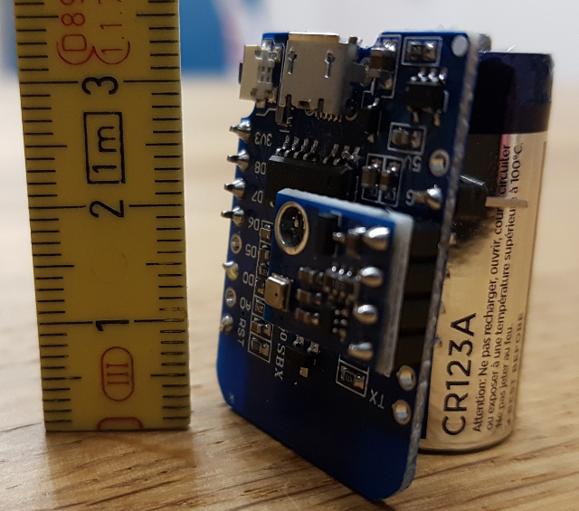
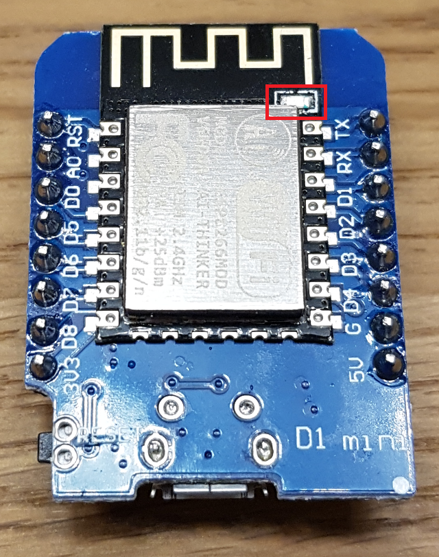
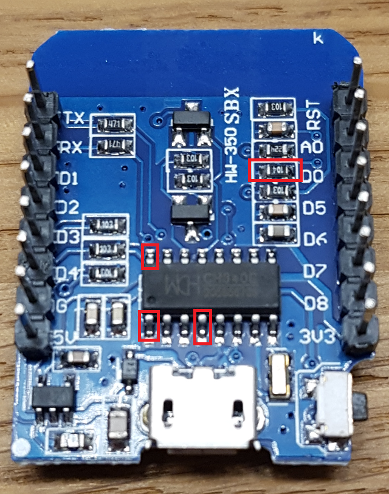
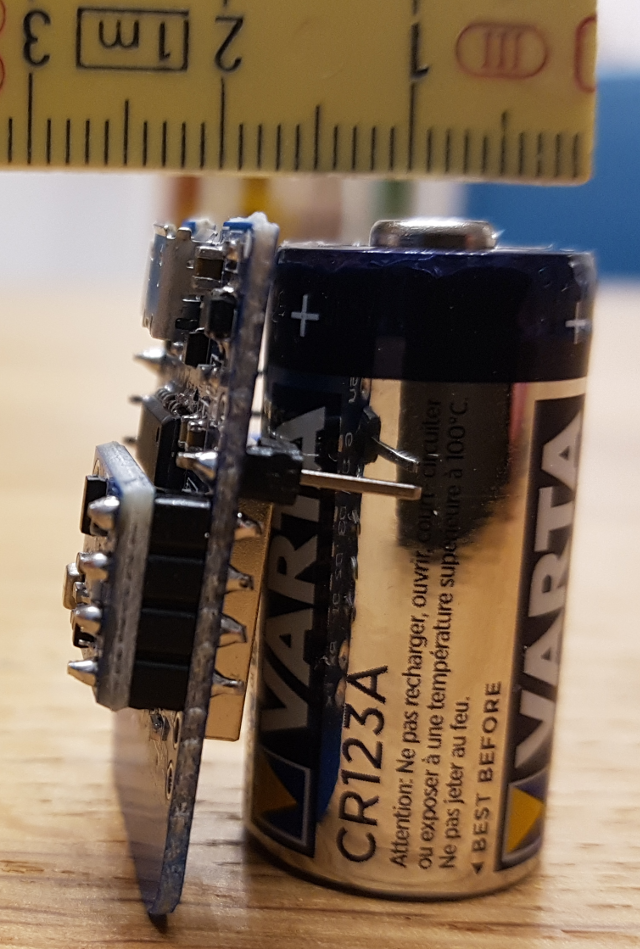
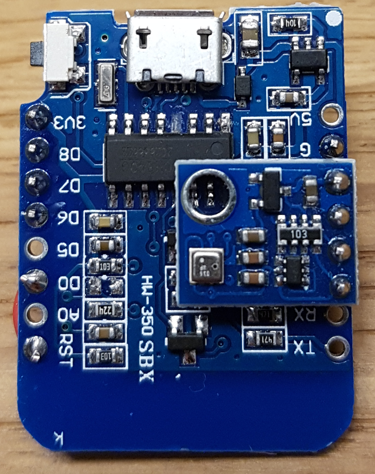
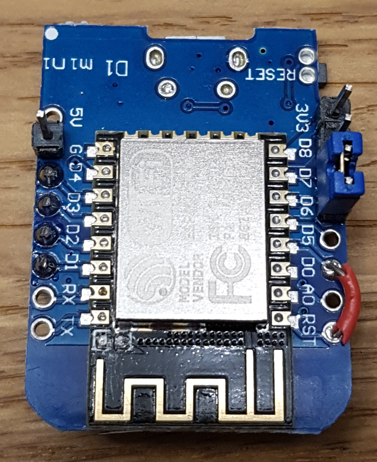
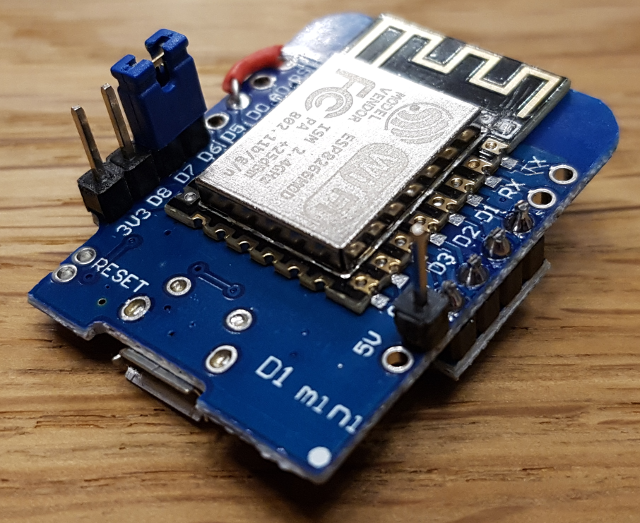
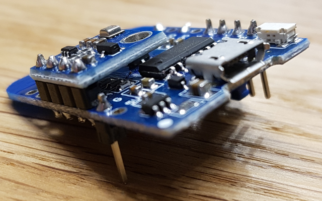

# ESP8266_BME280
Low energy temperature and humidity sensor with ESP8266 (Wemos D1 Mini) and Bosch BME 280 publishing to MQTT.

# Build Ingredients
* Wemos D1 Mini
* BME280 on 4 pin board (VCC, GND, SDA, CLK)
* Jumper + short piece of jumper wire
* Battery/batteries with ~3.3V, e.g. 2x AA or 1x CR123A

## How To
* Modify defines.h to your needs.

| Parameter | Meaning |
| --- | --- | 
| WIFI_SSID | Your WiFi SSID to connect to. | 
| WIFI_PASSWD | Your WiFi password. | 
| WIFI_CONNECT_TIMEOUT_SECS | If connection is not possible within WIFI_CONNECT_TIMEOUT_SECS seconds, module goes back to sleep to save power and will try to reconnect in... | 
| WIFI_RECONNECT_WAITTIME_SECS | ... WIFI_RECONNECT_WAITTIME_SECS seconds. | 
| IP_ADDR | IP address of the module. | 
| IP_GATEWAY | Gateway IP address. | 
| IP_SUBNET | Subnet mask. | 
| MQTT_SERVER | IP address of your MQTT server. In case you want to configure more than that, you have to tweak the code. | 
| LOCATION | Used to build the MQTT topic names: home/LOCATION/temperature is temperature in degrees celsius. home/LOCATION/humidity is humidity in percent. home/LOCATION/vcc is voltage measurement between 3V3 and GND to allow to listen to draining batteries. | 
| INTERVAL_READ_SENSOR_SECS | Module wakes up every INTERVAL_READ_SENSOR_SECS seconds to read BME280 data. | 
| INTERVAL_SEND_DATA_SECS | BME280 data is sent at least every INTERVAL_SEND_DATA_SECS seconds... | 
| THRESHOLD_SEND_DATA_TEMPERATURE | ...or at any wakeup if temperature difference (value in 1/10th degrees) is greater than THRESHOLD_SEND_DATA_TEMPERATURE... | 
| THRESHOLD_SEND_DATA_HUMIDITY | ... or at any wakeup if humidity difference is greater than THRESHOLD_SEND_DATA_HUMIDITY... | 
| ADJUST_TEMPERATURE | Correction value for temperature. | 
| ADJUST_HUMIDITY | Correction value for humidity. | 
| PIN_BME_* | Pin mapping for BME280 module. | 

* Compile code and upload.
* If code is working get rid of unnecessary components on the board. Remove the following parts:

**ATTENTION!!!** After doing so, you cannot upload code via USB interface. Nevertheless OTA updates (or RX/TX usage) is still possible.

* Solder BME280 module to D1 to D4 (doublecheck pin mapping according to defines.h)
* Solder wire between D0 and RST
* Solder pins for at least 3V3, GND, D6, D7 (see pictures)
* For normal operations put jumper across D6 and D7. For safe mode start (e.g. OTA update) remove jumper.
* Attach power supply (e.g. battery) to 3V3 and GND.
* Enjoy...
* Build a case...

## More Pictures

